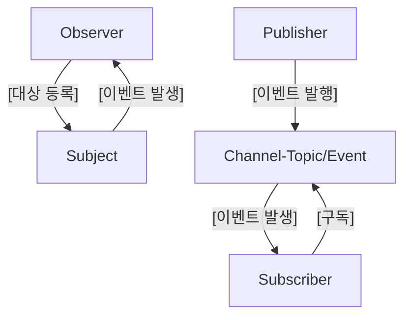

## 관찰자 패턴

한 객체가 변경 될 떄 다른 객체들에게 변경됨을 알릴 수 있게 해주는 패턴

변경된 객체는 누가 자신을 구독하는지 알 필요 없이 알림을 보낼 수 있음

### 주체

관찰자 리스트를 관리하고, 추가와 삭제를 가능하게 함

**책임**
1.	구독자 목록을 관리한다.
2.	알림을 모든 구독자에게 전파한다.

### 관찰자

주체의 상태 변화 알림을 감지하는 update 인터페이스 제공

### 구체적 주체

상태 변화에 대한 알림을 모든 관찰자에게 전달하고, ConcreateObserver의 상태를 저장한다.

### 구체적 관찰자

ConcreteSubject의 참조를 저장하고 관찰자의 update 인터페이스를 구현하여 주체의 상태 변화가 일치할 수 있도록 한다.

Observer 패턴은 다양하게 활용할 수 있지만 비동기 호출 혹은 이벤트 기반 데이터를 처리할 때 매우 유용하다. 만약 어떤 컴포넌트가 특정 데이터의 다운로드 완료 알림을 받기 원하거나, 사용자가 메시지 보드에 새로운 메시지를 게시했을 때 모든 멤버가 알림을 받거나 하는 등의 상황 말이다.

### 한계

- 단순한 이벤트 전달에 그치고,
- 전달되는 데이터 흐름을 조합하거나 변형하는 도구가 거의 없음.

⇒ 데이터 흐름을 다루는 더 강력한 방식”이 필요해지고, 그 다음 단계가 반응형 프로그래밍

 ### RxJS Observable 방식 (Unicast)

```jsx
const observable = new Observable(subscriber => {
 // 이 함수가 구독할 때마다 실행됨
 // = "각 구독자마다 독립적인 알림 시스템"*
  
  subscriber.next(1);
  subscriber.next(2);
  subscriber.next(3);
});

// 구독자1: 독립적인 실행*
observable.subscribe(val => console.log('구독자1:', val));
// 출력: 1, 2, 3// 구독자2: 또 다른 독립적인 실행*
observable.subscribe(val => console.log('구독자2:', val));`
```

### 관찰자 패턴과 발행/구독 패턴의 차이



**발행/구독 패턴의 핵심**

발행자와 구독자를 각자 독립적으로 유지한다.

### 관찰자 패턴과 발행구독 패턴의 장점

- 애플리케이션 구성 요소의 관계를 고민해 볼 수 있는 기회를 마련해줌
- 각각의 요소들이 직접 연결되어 있는 곳을 파악하여 주체와 관찰자의 관계로 대체할 수 있는 부분을 찾아낼 수 잇도록 도움을 줌

⇒ 이를 통해, 애플리에킹션을 더 작고 느슨하게 연결된 부분으로 나눌 수 있음, 결과적으로 코드의 관리와 재사용성을 높일 수 잇음.

### 단점

발행자 구독자 패턴

- 발행자와 구독자가 분리됨으로써 특정 부분들이 기대한느 대로 동작하고 있다는 것을 보장하기 어려움
    - 여기서 발행자 구독자 패턴의 동적이란 말이 강조되고 있는데, 이는 퍼블리셔가 구독자가 누군지 알 수 없기 떄문,
 
# 중재자 패턴

하나의 객체가 이벤트 발생 시 다른 여러 객체들에게 알림을 보낼 수 있는 패턴

↔ 관찰자(옵저버)패턴은 하나의 객체가 다른 객체에서 발생하는 다수의 이벤트를 구독할 수 있음

```jsx
저버 패턴:
Observer1 ──┐
Observer2 ──┼─ Subject (의존)
Observer3 ──┘
     ↑
     └─ Subject 변경만 감지
        Observer 간에는 상관없음

중재자 패턴:
Colleague1 ──┐
Colleague2 ──┼─ Mediator (의존)
Colleague3 ──┘
     ↑
     └─ Colleague의 행동이 다른 Colleague에게 영향
        그 영향을 Mediator가 중앙에서 관할
```

### 선택: 언제 무엇을 사용해야할까

이벤트 집합 패턴 활용

리엑트의 useState, useContext hook 을 사용하여 이벤트 집합 패턴 구현 가능, 상위 컴포넌트는 context api를 통해 상태를 관리하고 하위 컴포넌트들은 useContext api 를 사용해 해당 상태를 구독하고 사용

# 커맨드 패턴

매서드 호출, 요청 또는 작업을 단일 객체로 캡슐화하여 추후에 실행할 수 있게 해줌

### 기본 원칙

명령을 내리는 객체와 명령을 실행하는객체의 책임 분리
